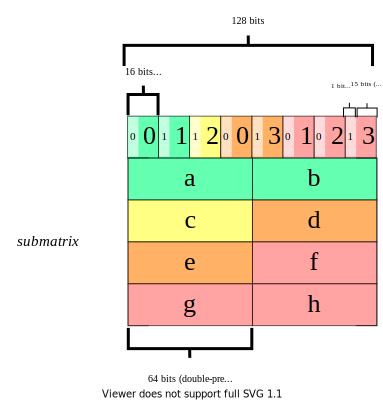

# SpMV on FPGA

### How-to build
Specify the following parameters when building :

| Option | Description |
|:------ |:----------- |
| TARGET | Compile for hardware (hw) or emulation (emu) (default : emu) |
| CU     | Number of Compute Units instantiated, that work will be distributed to (default : 1) |
| VF     | Vectorization-factor applied to computations (Unroll factor on computations kernel) (default : 1) |
| DOUBLE | Whether single-(0) or double-precision(1) arithmetic will be used (default : 1) |

Valid inputs for CU are 1, 2, 4, 8, 10, 12 and for VF are 1, 2, 4, 8

#### Example make usage 

```
make TARGET=hw CU=8 VF=4 DOUBLE=1
```

Note : Code is targeted for Xilinx ZCU102 platform only. Building for different platform requires modification of [Makefile](./Makefile) and [util.h](./src/util.h) files, so as to consider board-specific constraints.

### How-to run

```
./run.elf <matrix-file>
```

Note : Input matrix values have to be sorted row-wise.

---

## Code
Functions defined in [csr_hw_wrapper.cpp](./src/csr_hw_wrapper.cpp) are to be used by the programmer :

| Function | Description |
|:-------- |:----------- |
| ``` create_csr_hw_matrix(matrix, hw_matrix, empty_rows_bitmap) ```  | Given a matrix in CSR representation format ( ***matrix*** ), return the matrix in FPGA-optimized representation ( ***hw_matrix*** ). ***hw_matrix*** is an array of *csr_hw_matrix* type. Each element of it corresponds to a different Compute Unit. Separate representation is created for each Compute Unit. In addition, an ***empty_rows_bitmap*** is created, in order to reduce memory footprint of hw_matrix representation.|
| ``` create_csr_hw_x_vector(hw_x, x, blocks, nr_cols) ``` | Since the matrix is split in blocks, only a part of x vector is transferred to the FPGA for each block. Fill ***hw_x*** with the values of ***x*** that was previously created.|
| ``` create_csr_hw_y_vector(hw_matrix, hw_vector) ``` | For each Compute Unit and for each block that the matrix will be split to, create intermediate-results y vectors.|
| ``` spmv_hw(hw_matrix, hw_x, y_fpga, empty_rows_bitmap) ``` | Create intermediate-results y vectors for each Compute Unit and for each block. Then, call the hardware function *spmv* that runs on FPGA, calculating the result of multiplying ***hw_matrix*** with ***hw_x*** . Finally, accumulate the results of the intermediate y vectors, using ***empty_rows_bitmap*** information, storing them in ***y_fpga***, that is returned to main function.|
| ``` delete_csr_hw_matrix(hw_matrix) ``` | Free allocated memory for hw_matrix|
| ``` delete_csr_hw_x_vector(hw_vector) ``` | Free allocated memory for (hw) x vector |
| ``` delete_csr_hw_y_vector(hw_vector) ``` | Free allocated memory for (hw) y vector |

Note : Intermediate-results hw y vector is allocated and freed in **spmv_hw** function, therefore functions **create_csr_hw_y_vector** and **delete_csr_hw_y_vector** are not used in 'main' function.

---

## Images

A Sparse matrix :
<p align="center"></p>

CSR Representation format :
<p align="center"></p>

HW Representation format :
<p align="center"></p>

For each Compute Unit, one struct is used for representation of the sparse matrix; **submatrix**. This struct is 128-bits wide, in order to fully utilize the available memory bandwidth of HP ports of Xilinx ZCU102.

- **submatrix** : For each non-zero element, its column index and its value are needed for the kernel. First, 8 column indices are packed in 128 bits. For each non-zero, the first 15 bits are used to encode its column index. Since we apply 2D Blocking to the sparse matrix, 15 bits are enough to represent the column index of each non-zero. The last bit indicates whether the current non-zero is the last element of its row (1 when last, 0 otherwise). We need to know when the last element of a row is being processed, so as to forward the result to the results-stream in hardware function. After streaming column indices, we need to stream the respective 8 values. Depending on the precision that is used, 4 elements of this struct are needed when using double-precision (2 when single-precision).


---

## HW Functions

Functions defined in [spmv.cpp](./src/spmv.cpp). 

For each Compute Unit, these functions are instantiated, and perform in Dataflow model.

| Function | Description |
|:-------- |:----------- |
| ``` read_data_submatrix(nr_elems, submatrix, col_fifo_wide, values_fifo_wide) ``` | Read column-indices or values packed in 128-bits from ***submatrix*** struct, that is sent from host to FPGA, and push them to *hls::stream* ***col_fifo_wide*** or *hls::stream* ***values_fifo_wide*** respectively. |
| ``` stream_data_col_ind(nr_ci, col_fifo_wide, col_fifo) ``` | Unpack column-indices from wide *hls::stream* ***col_fifo_wide*** and stream to another *hls::stream*, called ***col_fifo***  . |
| ``` stream_data_values(nr_val, values_fifo_wide, values_fifo) ``` | Unpack values from wide *hls::stream* ***values_fifo_wide*** and stream to another *hls::stream*, called ***values_fifo***  . |
| ``` compute_results(col_fifo, values_fifo, nr_nzeros, x, results_fifo) ``` | Pop data from ***col_fifo*** and ***values_fifo*** and perform computations, with the respective elements of ***x*** . Push results for each row to *hls::stream* ***results_fifo*** . |
| ``` write_back_results(results_fifo, nr_rows, y) ``` | Pop results from results_fifo and write them to y vector, that will be sent from FPGA to host. |

Different **spmv** and **spmv_kernel** functions are used for different number of Compute Units. Here, we present the case for 2 Compute Units.

``` c
spmv(
    nr_rows1,   nr_rows2,
    nr_nzeros1, nr_nzeros2,
    submatrix1, submatrix2,
    nr_ci1,     nr_ci2,
    nr_val1,    nr_val2,
    y1,         y2,
    x,          nr_cols)
```
**spmv** : This is the function that is being called from host side. For each Compute Unit, the number of rows and number of non-zeros that are processed are given, since these are the sizes of the y vector and col_ind,values structs respectively. Count of packed col_ind elements and count of packed values elements (nr_ci and nr_val respectively) are needed to fill the respective FIFOs with the appropriate amount of elements. In addition, a separate copy of x vector (of size nr_cols) is created for each Compute Unit, since data-sharing between Compute Units is not allowed in HLS. Finally, the **spmv_kernel** function is called.

``` c 
spmv_kernel(
    nr_rows1,   nr_rows2,
    nr_nzeros1, nr_nzeros2,
    submatrix1, submatrix2,
    nr_ci1,     nr_ci2,
    nr_val1,    nr_val2,
    y1,         y2,
    x1,         x2)
```

**spmv_kernel** : In this function, instances of the previously presented functions are created for each Compute Unit. These function calls are independent between Compute Units and operate in parallel.
